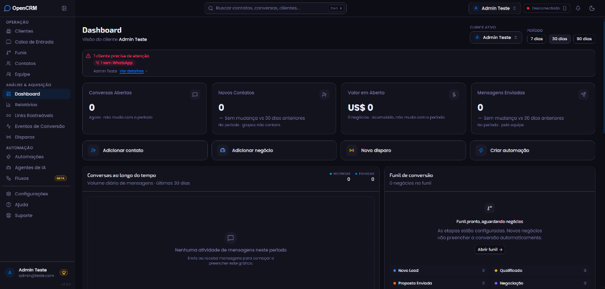
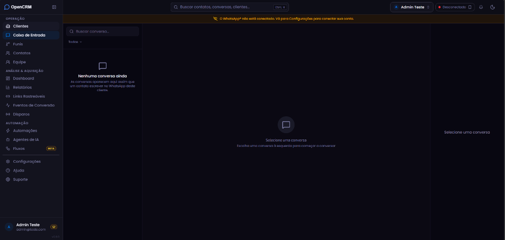
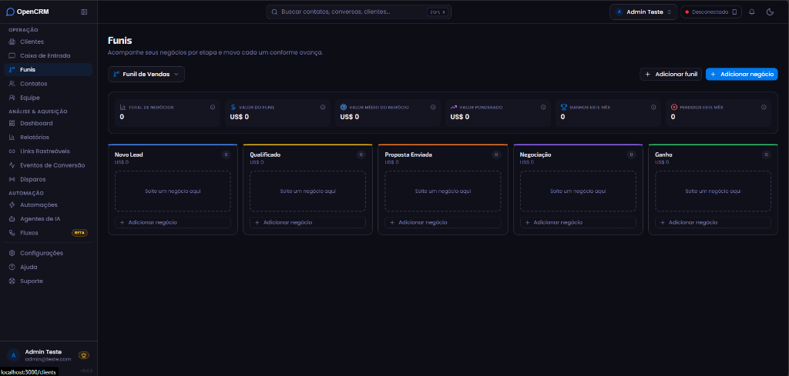
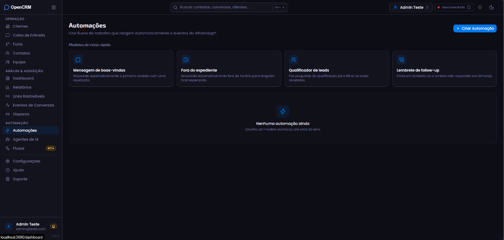
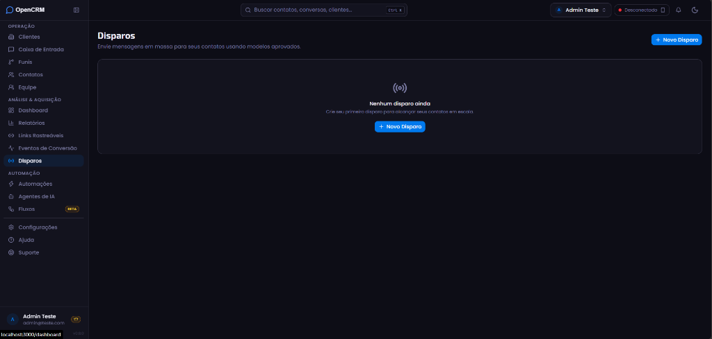
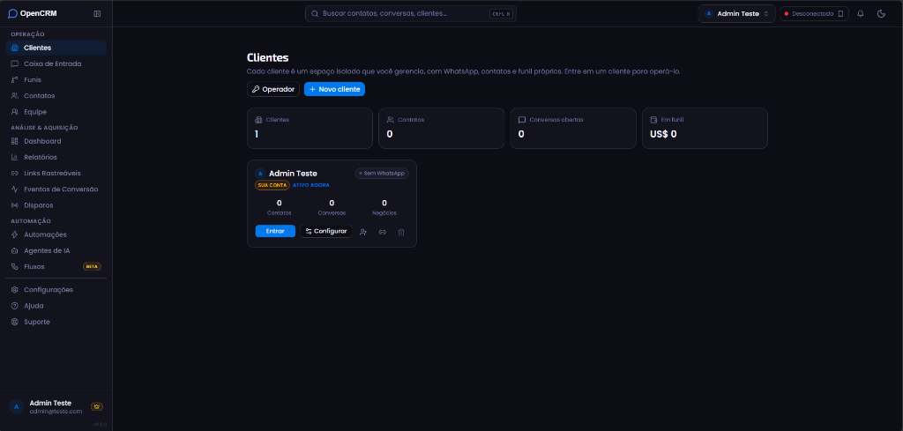
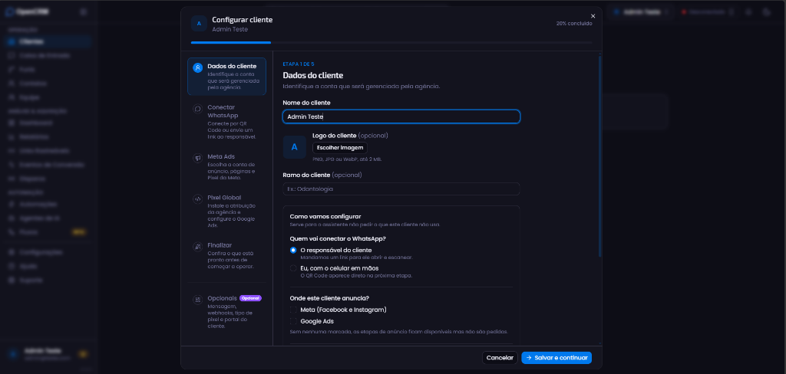
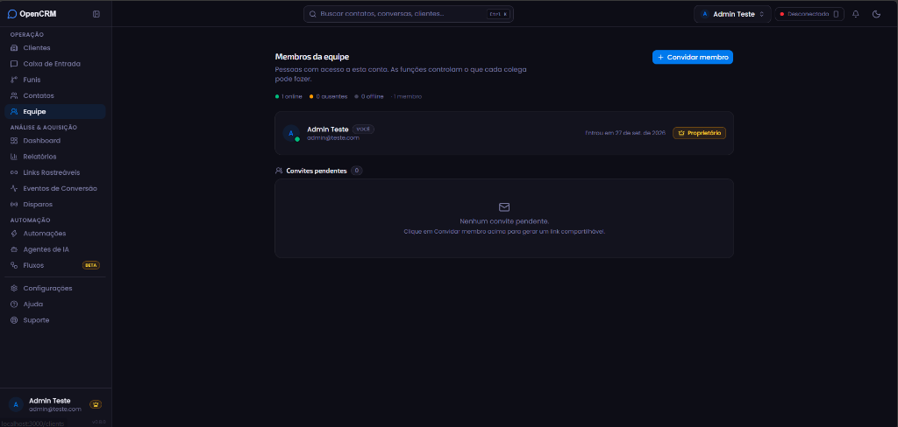

# OpenCRM — Self-Hosted WhatsApp CRM

> Open-source, self-hostable CRM for WhatsApp® — shared inbox, contacts, sales pipelines (Kanban), broadcasts, AI assistants, and no-code automations. Built with Next.js, Supabase, and Tailwind CSS.

[](./LICENSE)
[](https://nextjs.org)
[](https://supabase.com)
[](https://www.typescriptlang.org)
[](https://tailwindcss.com)

---

<p align="center">
  
</p>

---

## ✨ Recursos Principais

- **Caixa de Entrada Compartilhada (Shared Inbox)** — Múltiplos atendentes em um único número, atribuição por conversa, status, tags e notas internas.
- **Suporte Híbrido ao WhatsApp**:
  - **Evolution API** (QR Code / WhatsApp Web via Baileys) — sem custos de template por mensagem e sem bloqueio rígido de janela de 24 horas.
  - **Meta Cloud API Oficial** — alta entregabilidade para envios em massa homologados.
- **Gestão de Contatos & CRM** — Tags, campos personalizados, histórico unificado e deduplicação inteligente.
- **Funis de Vendas (Kanban)** — Arraste e solte negócios entre etapas diretamente vinculadas às conversas do WhatsApp.
- **Disparos em Massa (Broadcasts)** — Envio com templates homologados, substituição dinâmica de variáveis e métricas de entrega e leitura.
- **Automações Sem Código (No-Code Flows)** — Construtor visual de fluxos com gatilhos por mensagem recebida, palavra-chave, novos contatos ou agendamento.
- **Assistente de IA & Base de Conhecimento** — Respostas sugeridas com um clique e bot automático configurável com chave própria (OpenAI ou Anthropic). Busca híbrida em documentação própria (Full-Text e vetores no Postgres).
- **Múltiplas Contas & Equipe** — Gestão de membros com níveis de acesso (proprietário, administrador, atendente e visualizador).
- **API REST Pública (`/api/v1`)** — Chaves de API com escopos específicos para integrações e webhooks externos.

---

## 📸 Demonstração do Sistema

### 1. Caixa de Entrada Unificada (Inbox WhatsApp)
Atendimento centralizado com histórico completo, filtros e chat em tempo real:
<p align="center">
  
</p>

### 2. Funis de Vendas (Kanban)
Acompanhamento visual de propostas, leads qualificados e negociações:
<p align="center">
  
</p>

### 3. Automações e Fluxos Sem Código
Modelos rápidos de autoatendimento, fora do expediente, qualificação e lembretes:
<p align="center">
  
</p>

### 4. Disparos em Massa (Broadcasts)
Envio de campanhas em escala para seus contatos e clientes:
<p align="center">
  
</p>

### 5. Gestão de Clientes e Espaços de Trabalho
Organização de múltiplos números, clientes e empresas em ambientes isolados:
<p align="center">
  
</p>

### 6. Assistente de Configuração de Cliente
Wizard passo a passo para conectar WhatsApp, Meta Ads e Pixel:
<p align="center">
  
</p>

### 7. Controle de Equipe e Permissões
Convite para novos operadores e atribuição de níveis de acesso:
<p align="center">
  
</p>

---

## 🛠️ Stack Tecnológica

- **Frontend & Backend**: Next.js 16 (App Router), React 19, TypeScript, Tailwind CSS v4.
- **Banco de Dados & Autenticação**: Supabase (PostgreSQL com Row Level Security, Auth e Storage).
- **Conectores WhatsApp**: Evolution API e Meta Cloud API.

---

## 🚀 Como Executar Localmente

### 1. Clonar o repositório

```bash
git clone https://github.com/vpsantana98-dev/opencrm.git
cd opencrm
```

### 2. Instalar dependências

```bash
npm install
```

### 3. Configurar variáveis de ambiente

Copie o arquivo de exemplo e preencha com as credenciais do seu Supabase:

```bash
cp .env.local.example .env.local
```

Variáveis essenciais:
```env
NEXT_PUBLIC_SUPABASE_URL=https://seu-projeto.supabase.co
NEXT_PUBLIC_SUPABASE_ANON_KEY=sua-chave-anonima
SUPABASE_SERVICE_ROLE_KEY=sua-chave-service-role
ENCRYPTION_KEY=32_bytes_em_hex_para_criptografia_de_tokens
```

### 4. Executar em modo desenvolvimento

```bash
npm run dev
```

Acesse [http://localhost:3000](http://localhost:3000).

---

## 🌐 Deploy em Produção

O **OpenCRM** é uma aplicação Next.js padrão com suporte a Node.js e pode ser hospedado em qualquer provedor de sua preferência:

- **VPS / Docker** (Easypanel, Coolify, Dokku, Portainer, CapRover)
- **Serviços de Nuvem** (Hostinger Node.js, Vercel, Railway, Render, Fly.io)

### Variáveis para Produção:
Certifique-se de configurar:
- `NEXT_PUBLIC_SITE_URL`: URL canônica pública do seu CRM (ex: `https://crm.seudominio.com`).
- `ENCRYPTION_KEY`: Chave AES-256 de 32 bytes em formato hexadecimal para criptografia de credenciais do WhatsApp.
- Configurações da Evolution API ou Meta Cloud API conforme os canais que você for utilizar.

---

## ☕ Apoie o Projeto (Doações)

Se o **OpenCRM** foi útil para você ou para sua empresa, considere apoiar o desenvolvimento contínuo! O projeto é 100% aberto e gratuito.

- **GitHub Sponsors**: [github.com/sponsors/vpsantana98-dev](https://github.com/sponsors/vpsantana98-dev)

Toda contribuição ajuda a manter o projeto atualizado e novas funcionalidades sendo desenvolvidas! ❤️

---

## 📄 Licença

Distribuído sob a licença [MIT](./LICENSE). Sinta-se livre para usar, customizar e hospedar para seu uso ou de seus clientes.
